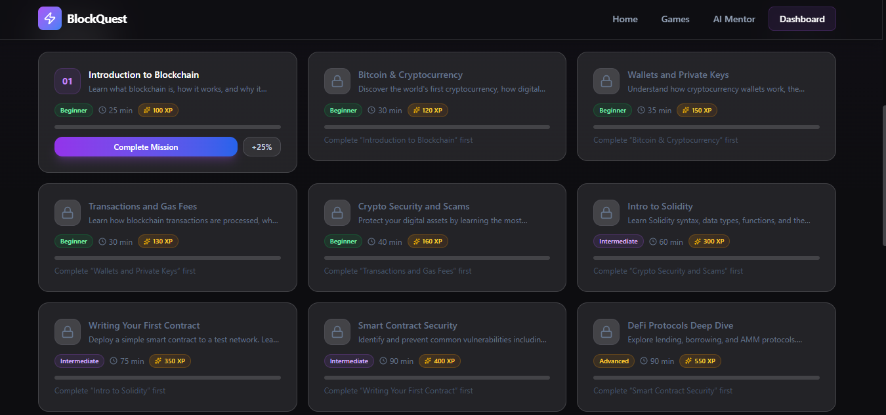

# 🚀 BlockQuest — Learn Blockchain Through Interactive Exploration

![BlockQuest Banner] (image.png)

## 🌐 Live Demo

🔗 **Deployed Application:**  
https://block-quest-sigma.vercel.app/


---

# 📌 Project Overview

## What is BlockQuest?

BlockQuest is a beginner-friendly, interactive blockchain learning platform designed to make cryptocurrency and Web3 education simple, engaging, and accessible for everyone.

Instead of traditional learning methods based on lengthy articles and complicated technical explanations, BlockQuest transforms blockchain education into an interactive experience using:

- Short learning modules
- Interactive quizzes
- Gamified progress tracking
- Achievement systems
- AI-powered learning assistance

The goal is to help beginners understand blockchain concepts without requiring any prior technical knowledge.

---

# 🎯 Problem Statement

Blockchain and cryptocurrency are rapidly growing technologies, but many beginners struggle to understand them because existing learning resources often contain:

- Complex technical terminology
- Long and difficult explanations
- Lack of practical examples
- No engaging learning experience

Many people become interested in blockchain but abandon learning because the initial concepts feel overwhelming.

BlockQuest solves this problem by providing a structured, beginner-focused learning environment where users can gradually understand blockchain concepts through interactive content and AI-assisted explanations.

---

# 👥 Target Users

BlockQuest is designed for:

- Students interested in blockchain and cryptocurrency
- Beginners entering Web3
- Technology enthusiasts
- Anyone curious about understanding blockchain fundamentals

The platform does not target a specific age group. Anyone willing to learn blockchain concepts can use it.

---

# ✨ Features

## 📚 Interactive Learning Modules

Users can learn blockchain concepts through structured learning paths.

Current topics include:

- Introduction to Blockchain
- Cryptocurrency Fundamentals
- Bitcoin and Digital Assets
- Blockchain Transactions
- Crypto Security and Safety

Each module focuses on explaining concepts in simple language with practical examples.

---

# 🧠 AI Blockchain Mentor

BlockQuest includes an AI-powered learning assistant that helps users understand difficult blockchain concepts.

The AI Mentor can:

- Explain complex blockchain terminology
- Simplify technical concepts
- Provide beginner-friendly examples
- Answer questions related to the current learning topic
- Help users overcome confusion during learning

The AI is designed as a learning assistant, not as a replacement for structured lessons.

---

# 🎮 Gamified Learning Experience

To make learning more engaging, BlockQuest includes game-inspired learning mechanics.

Features include:

- XP points
- Learning progress tracking
- Achievement rewards
- Completion milestones
- Interactive challenges

Users can monitor their learning journey and stay motivated.

---

# 📝 Interactive Quiz System

After learning concepts, users can test their understanding through quizzes.

Quiz features:

- Multiple-choice questions
- Instant feedback
- Score calculation
- Progress updates
- Learning reinforcement

---

# 📊 Progress Tracking

User progress is stored locally in the browser.

The application tracks:

- Completed lessons
- Quiz performance
- XP earned
- Learning progress

No account creation is required beacuse it is minimalistic app.

---

# 🔐 Beginner Crypto Safety Education

The application also introduces users to important security concepts:

- Importance of private keys
- Wallet safety
- Common crypto scams
- Safe blockchain practices

The objective is to help beginners avoid common mistakes while exploring Web3.

---

# 🤖 AI Feature Details

## AI Model Used

Gemini API is used for BlockQuest although its not working properly because of having a free version.

Examples:

- OpenAI API
- Gemini API
- Claude API
- Other compatible AI provider

---

## AI System Instructions

The AI Mentor follows a custom instruction set designed specifically for BlockQuest.

Example system prompt:

```
You are BlockQuest AI Mentor, a friendly blockchain education assistant.

Your purpose is to help beginners understand blockchain and cryptocurrency concepts.

Rules:
- Explain concepts using simple language.
- Avoid unnecessary technical jargon.
- Use real-world examples and analogies.
- Encourage learning step-by-step.
- Do not provide financial advice.
- Clarify concepts rather than making investment recommendations.
- Keep responses educational and beginner-friendly.
```

---

# 🛠️ Technology Stack

## Frontend

- React.js
- Vite
- JavaScript
- Tailwind CSS

## UI & Animation

- Framer Motion
- Lucide React Icons

## AI Integration

- [Your AI Provider/API]

## Deployment

- Vercel

## Version Control

- Git
- GitHub

---

# 📂 Project Structure

```
BlockQuest/

│
├── src/
│
├── components/
│
├── pages/
│
├── services/
│
├── data/
│
├── context/
│
├── assets/
│
└── public/
```

---

# 📸 Screenshots

## Landing Page

![Landing Page] (image-1.png)
![landing page] (image-2.png)
![landing page] (image-3.png)


## Learning Dashboard

![Dashboard] (image-4.png)



## AI Mentor

![AI Mentor] (image-6.png)


---

# ⚙️ Installation & Running Locally

## Prerequisites

Make sure you have installed:

- Node.js
- npm

---

## Clone Repository

```bash
git clone https://github.com/JunaidAliAU/BlockQuest.git
```

---

## Navigate to Project

```bash
cd BlockQuest
```

---

## Install Dependencies

```bash
npm install
```

---

## Configure Environment Variables

Create a file:

```
.env
```

Add required environment variables:

```
YOUR_AI_API_KEY=your_api_key_here
```


---

## Run Development Server

```bash
npm run dev
```

The application will run locally.

---

# 🚀 Deployment

The application is deployed using Vercel.

Deployment process:

1. Push project to GitHub.
2. Connect repository with Vercel.
3. Configure environment variables.
4. Deploy application.

Live URL:

block-quest-sigma.vercel.app

---

# 🔒 Security Practices

This project follows basic security practices:

- API keys stored using environment variables
- No sensitive information committed to GitHub
- Client-side data stored locally
- No financial transactions are performed

---

# 🔮 Future Improvements

Possible future enhancements:

- User accounts and cloud progress syncing
- More blockchain learning paths
- Interactive blockchain simulator
- Wallet simulation environment
- Multiplayer learning challenges
- More AI-powered learning features

---

# 👨‍💻 Developer

Created individually as a final AI application project.

Project Name:

**BlockQuest**

Purpose:

Making blockchain education simple, interactive, and accessible for beginners.

---

# 📄 License

This project is created for educational purposes.